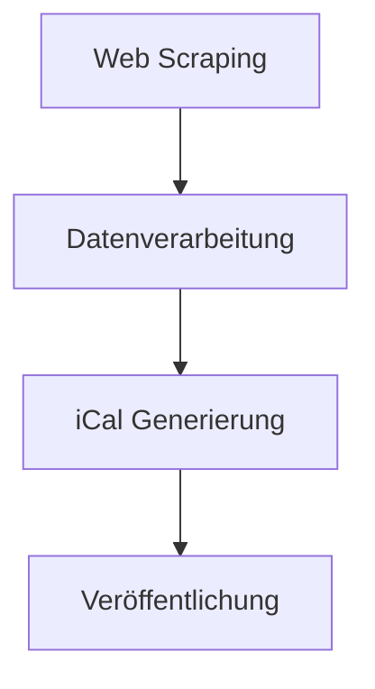

# Systemmuster und Architektur

## Gesamtarchitektur

## Kernkomponenten

### 1. Web Scraper
- Verwendet BeautifulSoup für HTML-Parsing
- Automatisierte Ausführung via scrape.sh
- Speichert Rohdaten im JSON-Format unter data/

### 2. Datenvergleich
- Vergleicht neue mit historischen Daten
- Erkennt Änderungen in Veranstaltungen
- Nutzt Hash-basierte Vergleichsmethode

### 3. iCal Generator
- Wandelt Veranstaltungsdaten in iCal-Format
- Nutzt icalendar Bibliothek
- Generierte Dateien werden unter data/ gespeichert

### 4. Hauptlogik
- Orchestriert den gesamten Workflow
- Verarbeitet Konfiguration und Logging
- Implementiert Fehlerbehandlung

## Entwurfsmuster

### Pipeline-Architektur
- Jede Komponente verarbeitet Daten und gibt sie weiter
- Klare Trennung der Verantwortlichkeiten

### Façade Pattern
- main.py bietet vereinfachte Schnittstelle
- Kapselt komplexe Operationen

### Strategy Pattern
- Vergleichsalgorithmen austauschbar
- iCal-Generierung erweiterbar

## Fehlerbehandlung
- Retry-Mechanismus für Scraping
- Validierung mit Pydantic-Modellen
- Ausführliches Logging
- Graceful Degradation bei Teilausfällen

## Konfiguration
- JSON-Konfigdatei für allgemeine Einstellungen
- Typehints für Konfigurationsdaten

## Logging
- Strukturierte Logs im JSON-Format
- Unterschiedliche Log-Level für Entwicklung/Produktion
- Zentrale Log-Konfiguration in main.py
